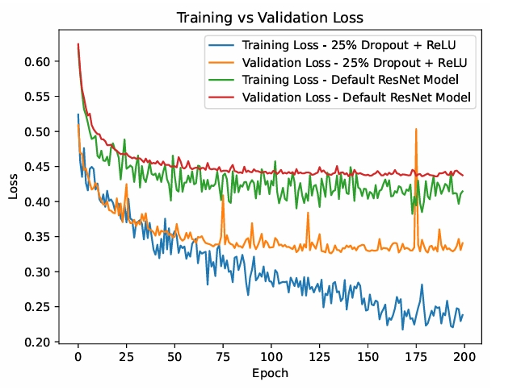

### Investigating CNN training data requirements for the classification of COVID-19 from chest X-rays

Convolutional Neural Networks (CNNs) have shown to be effective in classifying
 COVID-19 from X-ray scans but require large amounts of data, requiring an ex
treme effort to label from medical professionals. This paper attempts to explore
 the training data required for an effective COVID classifier through training models
 on different configurations of data after investigating optimal hyperparameters and
 classifier architecture. We show that although increases in training data improve the
 model’s performance, CNNs can still perform modestly within classification tasks on
 as low as 250 samples of data.

 

   <h1>Parameter and Architecture Tuning Example<h1>
  

